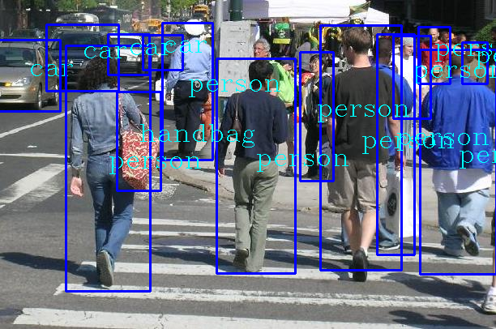
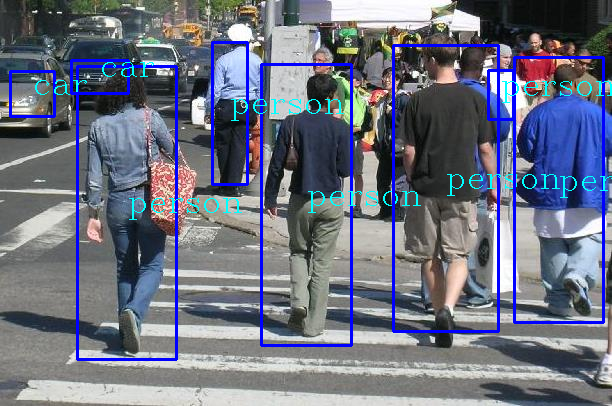

# Movement classification

The goal of this project would be movement classification of people, in other words, walking (normal and fast) and running.

Yolov4 will be used for detection.

# Yolov4 detection

## Yolo: Real-Time object detection
You only look once (YOLO) is a state-of-the-art, real-time object detection system. 

Currently the most advanced YOLO version is YOLOv4 which provides optimal speed and accuracy for object detection, therefore it will be used.

## Modules
Before starting, usage of a virtual environment is advised via the venv module:
```bash
$ python3 -m venv envname # to create the virtual env
$ source envname/bin/activate # activate it
$ deactivate # when done
```

For ease of use, the [tensorflow-yolov4](https://pypi.org/project/yolov4/) Python module was used, which is a YOLOv4 implementation in Tensorflow 2. 
For further documentation refer to the [project wiki](https://wiki.loliot.net/docs/lang/python/libraries/yolov4/python-yolov4-about/)

To install tensorflow-yolov4 install:

Dependencies:
```bash
$ python3 -m pip install opencv-python tensorflow
```
Note: If tensorflow lite needs to be used, refer to the (project wiki)[https://wiki.loliot.net/docs/lang/python/libraries/yolov4/python-yolov4-about/].

For the CPU only version:
```bash
$ python3 -m pip install yolo34py
```

For the GPU version:
```bash
$ python3 -m pip install yolo34py-gpu
```

Download the base model files:
```bash
$ bash ./init/download_models.sh
```
If need be:
```bash
$ chmod u+x ./init/download_models.sh
```

## Test yolov34py
```bash
$ python3 test_yolov34py.py
```

## Using yolov3-tiny
Download the yolov3-tiny model files:
```bash
$ wget -O weights/yolov3-tiny.weights https://pjreddie.com/media/files/yolov3-tiny.weights
$ wget -O cfg/yolov3-tiny.cfg https://raw.githubusercontent.com/pjreddie/darknet/master/cfg/yolov3-tiny.cfg
```
Change `Detector(...)` parameters in `test_yolo34.py` to `yolov3-tiny.cfg` and `yolov3-tiny.weights`

## Test results
Yolov3             |  Yolov3-tiny
:-------------------------:|:-------------------------:
  |  

## Scripts
- test\_yolo34py.py - used for testing the yolo34py module, with the yolov3 and yolov3-tiny models
- extract_frames.py - used for video frames extraction 

## Datasets
The test image `dataset/PennPed00001.png` is from the [Penn-Fudan database.](https://www.cis.upenn.edu/~jshi/ped_html/)

## Pip freeze
Example of working module versions. `$ python3 -m pip freeze`:
```bash
certifi==2020.12.5
chardet==4.0.0
Cython==0.29.23
idna==2.10
numpy==1.20.3
opencv-python==4.5.2.52
requests==2.25.1
urllib3==1.26.5
yolo34py==0.2
```
Tested on `Archlinux 5.12.7-arch1-1`, python version `Python 3.9.5`

If using on Arch change `python3` to `python` in instructions.
