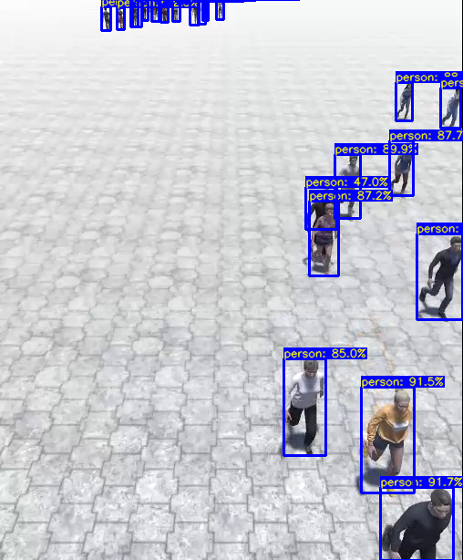
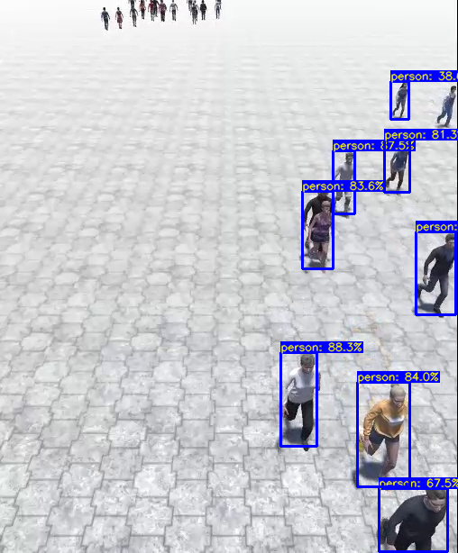

# Movement classification

The goal of this project would be movement classification of people, in other words, walking (normal and fast) and running.

Yolov4 will be used for detection.

# Yolov4 detection

## Yolo: Real-Time object detection
You only look once (YOLO) is a state-of-the-art, real-time object detection system. 

Currently the most advanced YOLO version is YOLOv4 which provides optimal speed and accuracy for object detection, therefore it will be used.

## Modules
Before starting, usage of a virtual environment is advised via the `venv` module:
```bash
$ python3 -m venv envname # to create the virtual env
$ source envname/bin/activate # activate it
$ deactivate # when done
```

For ease of use, the [`yolov4`](https://pypi.org/project/yolov4/) Python module was used, which is a YOLOv4 implementation in TensorFlow 2. 
For further documentation refer to the [project wiki](https://wiki.loliot.net/docs/lang/python/libraries/yolov4/python-yolov4-about/)

To install `yolov4`:

Dependencies:
```bash
$ python3 -m pip install opencv-python tensorflow
```
Note: If TensorFlow Lite needs to be used, refer to the [project wiki](https://wiki.loliot.net/docs/lang/python/libraries/yolov4/python-yolov4-about/) for further instructions.


TensorFlow YOLOv4:
```bash
$ python3 -m pip install yolov4
```

Download the `yolov4-tiny` and `yolov4` weights to the `weights/` directory from the project wiki [weights download section](https://wiki.loliot.net/docs/lang/python/libraries/yolov4/python-yolov4-about/#download-weights).


Test `yolov4` with the provided default test image. Change model config, weights based on the one used (default is `yolov4-tiny`).
```bash
$ python3 test.py
```

## Test results
KACAVIS runaway\_walk\_1.mp4 frame 1471 was used:
YOLOv4             |  YOLOv4-tiny
:-------------------------:|:-------------------------:
  |  

## Help
```python
>>> from yolov4.tf import YOLOv4
>>> help(YOLOv4)
```

# SORT tracking
SORT is a barebones implementation of a visual multiple object tracking framework based on rudimentary data association and state estimation techniques. It is designed for online tracking applications where only past and current frames are available and the method produces object identities on the fly. 

While this minimalistic tracker doesn't handle occlusion or re-entering objects its purpose is to serve as a baseline and testbed for the development of future trackers.

## Modules
To install `SORT`:

Dependencies:
```bash
$ python3 -m pip install filterpy scikit-image lap
```

SORT:

```bash
mkdir tracking
cd tracking
$ git clone https://github.com/abewley/sort
```

## Bare bones usage
```python
from tracking.sort import *

#create instance of SORT
mot_tracker = Sort() 

# get detections
...
# update SORT
track_bbs_ids = mot_tracker.update(detections)

# track_bbs_ids is a np array where each row contains a valid bounding box and track_id (last column)
...
```
## Dataset
[FER's](https://www.fer.unizg.hr/?) dataset: [KACAVIS](http://kacavis.zemris.fer.hr/).`

Download the dataset:
```bash
wget -O dataset/crowd_simulation_dataset.zip  http://kacavis.zemris.fer.hr/datasets/Crowd_simulation_dataset_videos.zip
```

# Pip freeze
To get the used module versions, in other words `$ python3 -m pip freeze`, take a look at:
```bash
./pip_freeze.txt
```

Tested on `Archlinux 5.12.x-arch1-1`, python version `Python 3.9.5`

If working on Arch change `python3` to `python` everywhere.
